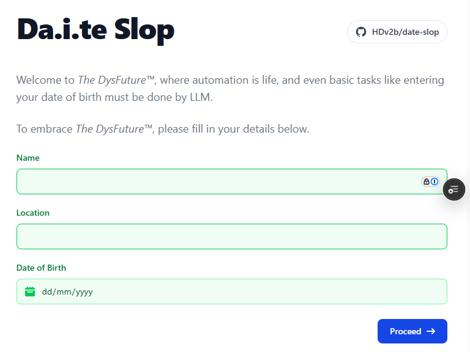

# Date Slop

An AI-powered date picker that makes entering your date of birth unnecessarily difficult. 🤖

**[Try the live demo](https://date-slop.hdv.dev)**



Date Slop was built as an entry for the **Bad UX World Cup**. I had the idea to parody how the modern web is littered with AI chat assistants which insist on making tasks more difficult. Instead of letting you simply enter your date of birth, the date field is hijacked by an AI assistant that insists on working it out for you, only it's not very good at it.

The challenge was finding the balance between **bad UX and unusable UX**. I wanted the AI to be bad enough to frustrate the user in an amusing way, without having that user give up completely and abandon the game.

The AI needed to:

- ask questions that could genuinely narrow down a date,
- understand indirect clues based on history, culture, technology and personal context,
- reject attempts to simply provide the date directly,
- make enough mistakes to support the joke without becoming completely incoherent,
- recognise when it had enough information to make a final guess,
- return control to the conventional form once it had decided on a date.

The original competition website is no longer online, but the [judging session is still available on YouTube](https://www.youtube.com/watch?v=PGpwoWGXBK0); you can see there was some tough competition.

Date Slop didn’t make the finals, apparently the UX wasn’t bad enough!

## 📝 Building it and lessons learned

This was my first AI-powered application and my first time using the OpenAI API. The main lessons were:

- **Give the model actions to follow.** Repeated prompt refinement helped, especially specifying how to respond when users break the rules instead of only telling it what not to do.
- **Prepare for cold starts.** Fetching the opening question in the background helps the conversation start sooner, with loading feedback when it takes longer.
- **Don't rely on server memory for conversation history.** Serverless instances can disappear mid-conversation. Moving the transcript to client-side state and sending it with each request solved this, while trusted instructions stayed on the server.
- **Bound costs and handle failures.** Rate limiting, billing controls, conversation limits and response token limits help contain abuse and unexpected costs. The UI also needs to explain when those protections interrupt a conversation.

The main takeaway: calling an AI API is only one part of building a usable feature. State management, reliability and failure handling still need ordinary software engineering, even when the UX is deliberately bad!

Read the full story: [Date Slop: building a deliberately bad UX with AI](https://dev.to/hdv/date-slop-building-a-deliberately-bad-ux-with-ai-3nml).

## 🎮 How to play

1. Open the [live demo](https://date-slop.hdv.dev).
2. Fill in your name and location.
3. Click the date-of-birth field.
4. Answer the assistant's questions using clues rather than explicit dates.
5. Keep going until it guesses your date of birth, then confirm the answer to fill in the field.

Trying to give it your date of birth directly won’t help — the assistant will reject it and keep asking questions.

## 🛠️ Tech

- **Next.js 16**
- **React 19**
- **TypeScript**
- **OpenAI API**
- **React Hook Form**
- **Tailwind CSS**

## 🚀 Running locally

This project uses `pnpm`.

### 1. Install dependencies

```bash
pnpm install
```

### 2. Configure the OpenAI API key

Create a `.env.local` file in the project root:

```env
OPENAI_API_KEY=your_openai_api_key_here
```

Keep this key private and do not commit it to source control.

### 3. Start the development server

```bash
pnpm dev
```

Then open [http://localhost:3000](http://localhost:3000).

### Production build

Build and run the application with:

```bash
pnpm build
pnpm start
```

When deploying, supply `OPENAI_API_KEY` as a server-side environment variable.

### E2E tests

Install the Playwright Chromium binary once, then run the smoke tests:

```bash
pnpm exec playwright install chromium
pnpm test:e2e
```

The E2E tests mock the guess API and do not require an OpenAI API key.
